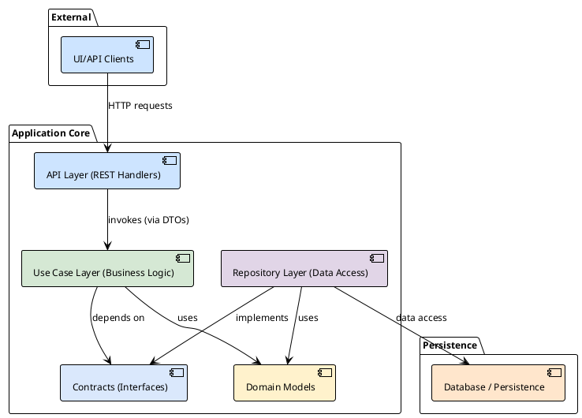

# Architecture and Development Principles

This document describes the key architectural decisions, principles, and tools used in the project. It is intended to quickly onboard new developers and synchronize understanding within the team.

## 1. Philosophy: Clean Architecture

The foundation of the project is **Layered Clean Architecture**. The main goal of this approach is Separation of Concerns, making the system flexible, testable, and easy to maintain.

The key rule is the **Dependency Rule**: dependencies in the source code can only point *inward*. Nothing in an inner layer can know about anything in an outer layer.



## 2. Project Structure and Layers

### `internal/domain`
This is the core of our application. Here are the domain entities (e.g., `User`, `Project`), which do not depend on any external frameworks or databases. They contain only logic specific to the business domain itself.

### `internal/contract`
Here are declared **interfaces** (contracts), which serve as "bridges" between layers. For example, use cases depend on repository interfaces, not their concrete implementations. This is the basis of the **Dependency Inversion (D)** principle from SOLID.

### `internal/usecases`
The business logic layer. Each use case encapsulates a specific action in the system (e.g., `users.Login`, `projects.Create`). This layer orchestrates work using domain entities and calling repository and service methods via their interfaces.

### `internal/repository`
The data access layer. Implements interfaces from `internal/contract`. Its task is to convert domain entities into storage-specific models (DB) and perform read/write operations.
- **Repository models:** Each repository package declares its own structures matching the table schema.
- **Conversion:** Each model has a `toDomain()` method that converts it to a domain entity. This isolates the domain from storage details.

### `internal/api/rest`
The outer layer responsible for interaction with the outside world via REST API. It contains HTTP handlers that accept requests, validate them, call the appropriate use cases, and format the response.

### `internal/services`
Auxiliary layer for integration with external systems (LDAP, email senders, messengers). These are client wrappers implementing the interfaces required by use cases.

## 3. Development Process: API-First

We follow the **API-First** approach. The source of truth for our REST API is the OpenAPI specification.

- **Specification:** `specs/server.yml`
- **Code generation:** `ogen` is used to generate the HTTP server, clients, and DTO structures. This ensures our implementation always matches the specification.
- **Command:** `make generate-backend`

Conversion between generated `ogen` structures and domain entities (and back) happens in `internal/dto`.

## 4. Transaction Manager

To ensure atomicity of operations affecting multiple repositories, a transaction manager (`pkg/db/TxManager`) is used. Use cases can run operations within a single transaction by passing a transactional context to repository methods. Repositories work with a simpler `pkg/db/Tx` interface.

## 5. Configuration

The application is configured via environment variables. The configuration structure is described in `internal/config/config.go`.

## 6. Building and Running the Application

The central entry point of the application is the `App` structure in `internal/app.go`.

- **DI container:** We use a DI container ([github.com/rom8726/di](https://github.com/rom8726/di)) for automatic initialization and injection of all dependencies (DB clients, repositories, use cases).
- **Startup:** The `App.Run()` method starts all components: HTTP server, background workers, etc.

## 7. Functional Testing

We pay great attention to automated testing. Our functional testing system provides high coverage and confidence in code quality.

- **Isolated environment:** Tests run in a fully isolated environment, created on the fly using **Testcontainers**. For each test run, Docker containers with Postgres, Kafka, Redis, and other dependencies are started.
- **Declarative test cases:** The tests themselves are described in YAML files in the `tests/cases` directory. Each file is a sequence of HTTP requests, response checks, and DB state checks.
- **Fixtures:** The initial database state for tests is defined in YAML files in `tests/fixtures`.
- **Test framework:** The internal `testy` library is used to run tests. It parses YAML files, executes requests to the app running in test mode, and compares results with expectations.
- **Run:** `go test -tags=integration ./tests/...`

This approach allows us to write complex E2E scenarios without a lot of Go boilerplate code.

## 8. Mocking and Unit Tests

For unit testing dependencies (e.g., repositories in use cases), we use mocks.

- **Tool:** `mockery`
- **Config:** `.mockery.yaml`
- **Command:** `make mocks`
- **Location:** Generated mocks are stored in `test_mocks/`.

## 9. Linting and Code Formatting

We use strict linting rules to ensure code quality and consistency.

- **Linter:** `golangci-lint` with configuration in `.golangci.yml`
- **Line length:** Maximum **120 characters** for all code (including tests)
- **Formatting:** Automatic formatting with `gofmt` and `gofumpt`

### Long Line Formatting Rules

If the 120-character limit is exceeded:

**Functions:**
```go
// ❌ Incorrect - line too long
func CreateUserWithDetailedProfile(ctx context.Context, username string, email string, firstName string, lastName string, role string, teamID int, isActive bool) (*User, error) {

// ✅ Correct - parameters in column
func CreateUserWithDetailedProfile(
    ctx context.Context,
    username string,
    email string,
    firstName string,
    lastName string,
    role string,
    teamID int,
    isActive bool,
) (*User, error) {
```

**Structs:**
```go
// ❌ Incorrect
type UserRepository interface {
    CreateUser(ctx context.Context, username string, email string, firstName string, lastName string, role string, teamID int, isActive bool) (*User, error)
}

// ✅ Correct
type UserRepository interface {
    CreateUser(
        ctx context.Context,
        username string,
        email string,
        firstName string,
        lastName string,
        role string,
        teamID int,
        isActive bool,
    ) (*User, error)
}
```

**Function calls:**
```go
// ❌ Incorrect
result, err := userService.CreateUserWithDetailedProfile(ctx, username, email, firstName, lastName, role, teamID, isActive)

// ✅ Correct
result, err := userService.CreateUserWithDetailedProfile(
    ctx,
    username,
    email,
    firstName,
    lastName,
    role,
    teamID,
    isActive,
)
```

## 10. Docker-Readiness

The project is fully ready for deployment in a Docker environment.

### Development with Docker Compose

- **Config:** `dev/docker-compose.yml` - full set of services for development
- **Management:** `dev/dev.mk` - commands for environment management
- **Environment variables:** `dev/config.env.example` - config template

### Main development commands

```bash
# Start environment
make dev-up

# Stop environment
make dev-down

# Full cleanup (remove containers, images, volumes)
make dev-clean

# View logs
make dev-logs

# Start with LDAP initialization
make dev-run
```

### Production Dockerfile

- **Multi-stage build:** Uses `golang:1.24-alpine` for build and `scratch` for the final image
- **Minimal size:** The final image contains only the binary and migrations
- **Security:** No shell or base utilities in the production image

## 11. Recommendations for AI Assistants

When generating code for this project, strictly follow these principles:

### Architectural Principles

1. **Layered architecture:** Never break boundaries between layers
    - API layer can only call use cases
    - Use cases can only call interfaces from `internal/contract`
    - Repositories implement interfaces from `internal/contract`

2. **Dependency Inversion:** All dependencies must go through interfaces
   ```go
   // ✅ Correct
   type UserService struct {
       userRepo contract.UserRepository
       emailService contract.EmailService
   }
   
   // ❌ Incorrect
   type UserService struct {
       userRepo *repository.UserRepository
   }
   ```

3. **Domain model:** Domain entities must not depend on external frameworks
   ```go
   // ✅ Correct - domain entity
   type User struct {
       ID       int
       Username string
       Email    string
   }
   
   // ❌ Incorrect - repository model
   type UserModel struct {
       ID       int    `db:"id"`
       Username string `db:"username"`
       Email    string `db:"email"`
   }
   ```

### Code Style

1. **Line length:** Strictly follow the 120-character limit
2. **Naming:** Use camelCase for variables and functions, PascalCase for exported types
3. **Error handling:** Always check errors, never ignore them
4. **Context:** Pass `context.Context` as the first parameter in methods that can be canceled

### Testing

1. **Unit tests:** Write tests for use cases using mocks
2. **Integration tests:** Create YAML files in `tests/cases/` for E2E scenarios
3. **Fixtures:** Define test data in `tests/fixtures/`

### API and DTO

1. **OpenAPI-first:** All API changes must start with updating `specs/server.yml`
2. **DTO conversions:** Use `internal/dto` for converting between API and domain structures
3. **Validation:** Validate input data at the API handler level

### Examples of correct code

**Use Case:**
```go
func (s *UserService) CreateUser(
    ctx context.Context,
    username string,
    email string,
) (*domain.User, error) {
    user := &domain.User{
        Username: username,
        Email:    email,
    }
    
    if err := s.userRepo.Create(ctx, user); err != nil {
        return nil, fmt.Errorf("create user: %w", err)
    }
    
    return user, nil
}
```

**Repository:**
```go
func (r *UserRepository) Create(
    ctx context.Context,
    user *domain.User,
) error {
    model := &UserModel{
        Username: user.Username,
        Email:    user.Email,
    }
    
    if err := r.db.WithContext(ctx).Create(model).Error; err != nil {
        return fmt.Errorf("insert user: %w", err)
    }
    
    user.ID = model.ID
    return nil
}
```

**API Handler:**
```go
func (h *UserHandler) CreateUser(w http.ResponseWriter, r *http.Request) {
    var req dto.CreateUserRequest
    if err := json.NewDecoder(r.Body).Decode(&req); err != nil {
        http.Error(w, "invalid request", http.StatusBadRequest)
        return
    }
    
    user, err := h.userService.CreateUser(r.Context(), req.Username, req.Email)
    if err != nil {
        http.Error(w, err.Error(), http.StatusInternalServerError)
        return
    }
    
    response := dto.UserFromDomain(user)
    json.NewEncoder(w).Encode(response)
}
```

By following these principles, you will create code that matches the project's architecture and easily integrates into the existing codebase.
